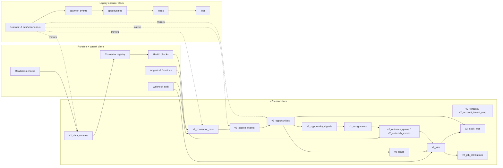
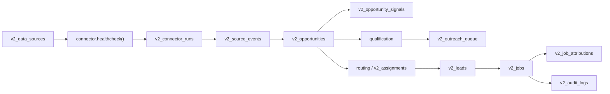

# Current State Map

This document maps the repo as it exists today, not as we want it to exist.

Legend:

- Implemented = real code path with live behavior
- Partial = real code path, but gated, legacy-mixed, or fallback-heavy
- Stubbed = demo/sample/compat behavior
- Risky = works, but can mislead operators or drift from the truth model
- Missing = no clear production-grade implementation yet

## System Topology

## Current Truth Model

### Canonical enough today

| Area | Current status | Evidence |
| --- | --- | --- |
| Tenant isolation | Implemented | `src/lib/v2/context.ts:80-143`, `supabase/migrations/20260314103000_franchise_v2_foundation.sql:526-705` |
| Source registry | Partial but real | `src/lib/control-plane/catalog.ts:16-185`, `src/lib/v2/connectors/registry.ts:1-38` |
| Source runs | Implemented | `src/lib/v2/connectors/runner.ts:675-904` |
| Source events | Implemented | `src/lib/v2/connectors/runner.ts:742-807` |
| Opportunities | Implemented | `src/lib/v2/connectors/runner.ts:441-658` |
| Qualification | Implemented | `src/lib/v2/opportunity-qualification.ts`, `src/app/api/opportunities/[id]/qualify/route.ts:64-181` |
| Routing / assignments | Implemented | `src/lib/v2/routing-engine.ts:185-260`, `src/app/api/opportunities/[id]/route/route.ts:10-58` |
| Outreach safety | Implemented | `src/lib/v2/outreach-orchestrator.ts:109-294`, `src/lib/v2/qualification-outreach-bridge.ts:94-165` |
| Booked-job attribution | Implemented | `src/lib/v2/booked-job-webhook.ts:146-255` |
| Production readiness | Implemented | `src/lib/v2/readiness.ts:79-141`, `src/app/api/health/production/route.ts:8-40` |

### Still split between legacy and v2

| Surface | Current behavior | Status |
| --- | --- | --- |
| Scanner run | Creates real public signals, writes legacy scanner tables, and mirrors into v2 when tenant mapping exists | Partial / risky |
| Opportunity list | Reads v2 when enabled, otherwise legacy | Partial |
| Dashboard home | Mixes legacy leads/jobs with v2 source health and capture proof | Partial |
| Jobs board | Legacy jobs remain the main board, even though v2 jobs exist | Partial |
| Leads board | Legacy leads remain the main board, even though v2 leads exist | Partial |

## Source and Ingestion Map

### Data source registry

| Registry | What it contains | Current state |
| --- | --- | --- |
| `src/lib/control-plane/catalog.ts:16-185` | Curated source catalog with live requirements, defaults, and provenance | Implemented |
| `src/lib/v2/data-sources.ts:294-389` | Tenant-specific data source summaries with latest run and latest event state | Implemented |
| `supabase/migrations/20260314103000_franchise_v2_foundation.sql:133-186` | Persisted `v2_data_sources`, `v2_connector_runs`, and `v2_source_events` tables | Implemented |

### Live connector families

| Connector key | Category | Current runtime shape | Status |
| --- | --- | --- | --- |
| `weather.noaa` | Weather / incident | Live NOAA alerts and forecast-driven risk | Implemented |
| `permits.production` | Permits | Live when provider config exists; otherwise static/sample fallback | Partial |
| `social.intent.public` | Social / public distress | Reddit search or Firecrawl-backed public-page scrape; can fall back to samples | Partial |
| `incidents.generic` | Public incident | Firecrawl or structured feed; citizen-style sources are blocked unless explicitly enabled | Partial |
| `water.usgs` | Water / flood | Live USGS data with approved terms | Implemented |
| `open311.generic` | Municipal 311 | Live endpoint, with NYC default fallback | Implemented |
| `disaster.openfema` | Disaster / catastrophe | Live FEMA context | Implemented |
| `enrichment.census` | Enrichment | Live Census enrichment | Implemented |
| `property.overpass` | Property | Live Overpass / OSM queries | Implemented |
| `utility.outages` | Utility / outage | Firecrawl search or sample fallback | Partial |

## Operator Surfaces

| Surface | Path | Current state |
| --- | --- | --- |
| Operator command center | `src/app/(dashboard)/dashboard/page.tsx:84-720` | Partial but useful |
| Scanner lane | `src/app/(dashboard)/dashboard/scanner/page.tsx:1-14`, `src/components/dashboard/lead-scanner-view.tsx:229-260` | Implemented / partial |
| Opportunity queue | `src/components/dashboard/opportunities-view.tsx:65-260` | Implemented / partial |
| Jobs board | `src/app/(dashboard)/dashboard/jobs/page.tsx:12-121` | Implemented, but legacy-first |
| Leads board | `src/app/api/leads/route.ts:25-166` plus dashboard routes | Implemented, but legacy-first |
| Territories | `src/app/api/territories/route.ts:8-74` | Partial and v2-gated |
| Data sources | `src/app/api/data-sources/route.ts:12-78` | Implemented and v2-gated |
| Connector runs | `src/app/api/connectors/runs/route.ts:26-160` | Implemented and v2-gated |
| Production readiness | `src/app/api/health/production/route.ts:8-40` | Implemented |

## Runtime Guards

| Guard | Where it lives | What it does |
| --- | --- | --- |
| Demo mode | `src/lib/services/review-mode.ts:14-25` | Enables local demo/review bypasses only in safe contexts |
| Synthetic filtering | `src/lib/services/scanner-truth.ts:9-27` | Hides demo/synthetic scanner records from live truth paths |
| Feature flags | `src/lib/config/feature-flags.ts` | Gates v2 reads, v2 writes, and polygon routing |
| Webhook auth | `src/lib/v2/webhook-auth.ts:7-28` | Fails closed if the shared secret is missing or wrong |
| Readiness gate | `src/lib/v2/readiness.ts:79-141` | Checks app URL, demo safety, Supabase, webhook secret, v2 flags, integrations, and tenant readiness |

## Current Scanner Path

### Live scanner

`src/lib/services/scanner.ts` already supports a real public-signal engine:

- NOAA weather alerts and forecast-driven risk
- OpenFEMA and USGS context
- Open311 municipal signal capture
- Firecrawl-backed public incident or distress pages when configured
- live enrichment for the first few opportunities in the run

Evidence:

- `src/lib/services/scanner.ts:503-587`
- `src/lib/services/scanner.ts:917-980`
- `src/lib/services/scanner.ts:1248-1768`
- `src/lib/services/scanner.ts:2076-2248`

### Demo scanner

Demo opportunities are still generated on purpose for local review and marketing flows:

- `src/lib/services/scanner.ts:729-856`
- `src/lib/services/review-mode.ts:14-25`

### Persisted run behavior

The scanner run endpoint does more than just fetch signals:

- filters synthetic opportunities before persistence
- writes legacy `source_events`, `scanner_events`, and `opportunities`
- mirrors into `v2_data_sources`, `v2_source_events`, `v2_opportunities`, and `v2_opportunity_signals` when a tenant mapping exists

Evidence:

- `src/app/api/scanner/run/route.ts:198-485`
- `src/app/api/scanner/run/route.ts:320-469`

## Current v2 Funnel

## Where Reads Still Diverge

| Read path | Current behavior | Risk |
| --- | --- | --- |
| `src/app/api/opportunities/route.ts:32-188` | Reads v2 when enabled, otherwise legacy opportunities | Operators can compare different truth sets |
| `src/app/api/scanner/events/route.ts:54-260` | Prefers legacy scanner events, then falls back to v2 opportunities when v2 reads are enabled | Scanner and opportunity views can disagree |
| `src/app/(dashboard)/dashboard/page.tsx:84-720` | Merges legacy lead/job data with v2 source health and proof chain data | Good for transition, risky for long-term canonicality |

## Runtime and Ops Map

| Concern | Current implementation | Status |
| --- | --- | --- |
| Connector run state | queued / running / completed / failed / partial | Implemented, but incomplete for stale/replayed semantics |
| Retry and idempotency | Upsert-based event writes and webhook idempotency tables | Implemented, but not yet a full run ledger |
| Health checks | Connector healthchecks + readiness endpoint | Implemented |
| Assignment SLA | Inngest watch/escalation flow | Implemented |
| Outreach suppression | Do-not-contact, suppression list, cooling window, safe-mode provider wrappers | Implemented |
| Failure visibility | Error summaries on runs and audit logs | Partial |

## Practical Takeaway

The current repo state can already support a real pilot if the operator workflow stays honest about live vs simulated coverage.

The next architecture step is not "build automation from scratch."

It is:

- make v2 the canonical plane
- keep legacy surfaces as compatibility views
- harden runtime state so runs are observable and replayable
- keep live-source truth visible everywhere an operator can act
