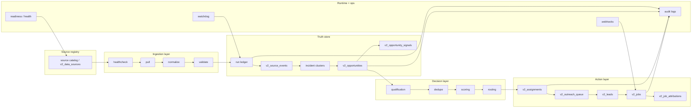

# Lead Engine Architecture

Target: a production-grade, hands-off lead-intelligence engine for home service businesses that is live-source first, explainable, tenant-safe, and stable under real operator use.

This architecture is designed to fit the current stack:

- Next.js app router
- Supabase Postgres + RLS + PostGIS
- Inngest for background workflows
- Twilio / HubSpot / email integrations
- existing v2 connector framework and dashboard surfaces

## Architecture Principles

1. Live-source truth beats synthetic convenience.
2. Every opportunity must be explainable back to one or more source events.
3. Tenant isolation is a hard boundary, not a best-effort convention.
4. Safe mode is the default for anything that can contact a customer.
5. The runtime must be replayable, observable, and idempotent.
6. Legacy compatibility is allowed, but only as a transitional layer.

## Target Architecture

## Canonical Data Model

### Source Registry

`v2_data_sources` should remain the operational registry, but each source record must be rich enough to answer these questions without guessing:

| Field | Required? | Notes |
| --- | --- | --- |
| `source_name` | Yes | Human label shown to operators |
| `source_category` | Yes | Weather, permits, incident, social, property, utility, municipal, enrichment |
| `connector_key` | Yes | Stable adapter key |
| `ingestion_type` | Yes | Poll, webhook, feed, scrape, import |
| `runtime_mode` | Yes | fully-live, live-partial, simulated |
| `freshness_timestamp` | Yes | Last real evidence from source |
| `freshness_sla_minutes` | Yes | How stale is too stale |
| `confidence_level` | Yes | Source-level trust score |
| `geography_support` | Yes | National, state, county, city, parcel, territory |
| `compliance_status` | Yes | approved, restricted, pending_review, blocked |
| `risk_notes` | Yes | Terms, scraping, rate limit, and buyer-proof risk |
| `normalization_strategy` | Yes | How raw records map to canonical events |
| `dedupe_strategy` | Yes | How same-source and cross-source duplicates are collapsed |
| `enrichment_dependencies` | Yes | What external lookups are needed |
| `routing_implications` | Yes | Which service lines / territories it influences |
| `failure_behavior` | Yes | fail closed, partial live, or simulated fallback |

### Canonical Opportunity

`v2_opportunities` should be the canonical opportunity object.

Required fields:

| Field | Purpose |
| --- | --- |
| `tenant_id` | Tenant boundary |
| `source_event_id` | One primary source event link |
| `incident_cluster_id` | Optional incident aggregation link |
| `opportunity_type` | Human-readable and machine-classifiable category |
| `service_line` | Primary service line |
| `title`, `description` | Operator-readable summary |
| `urgency_score` | Urgency / response pressure |
| `job_likelihood_score` | Likelihood this becomes booked work |
| `contactability_score` | Likelihood of reaching a real person |
| `source_reliability_score` | Trust in the source itself |
| `revenue_band` | low / medium / high / enterprise |
| `catastrophe_linkage_score` | Disaster / storm linkage |
| `location_text`, `location`, `postal_code` | Geography / territory routing |
| `contact_status` | unknown / identified / contacted / do_not_contact |
| `routing_status` | pending / routed / escalated / complete / failed |
| `lifecycle_status` | new / qualified / assigned / contacted / booked_job / closed_lost |
| `explainability_json` | Human and machine explanation trail |
| `created_at`, `updated_at` | Audit and freshness anchors |

Additional explainability fields that should be required in the target model:

- `source_types`
- `signal_count`
- `dedup_key`
- `primary_service_line`
- `secondary_service_lines`
- `confidence_reasoning`
- `next_recommended_action`
- `proof_authenticity`
- `contact_verification_status`
- `scanner_event_id` or `source_event_id`
- `job_attribution_id` once converted

## Pipeline State Machine

The opportunity pipeline should be explicit and durable.

| Stage | Meaning | Notes |
| --- | --- | --- |
| `raw` | Unprocessed source payload | Source-specific record before normalization |
| `normalized` | Common schema mapped | Raw payload now fits connector contract |
| `enriched` | Context added | Geography, property, business, and contact context |
| `deduped` | Collapsed against prior signals | Same event should not become multiple opportunities |
| `classified` | Service line and job type inferred | Restoration / plumbing / roofing / HVAC / etc. |
| `scored` | Explainable scores computed | Urgency, likelihood, confidence, monetization |
| `routed` | Territory or operator decision made | Includes assignment and SLA |
| `queued_for_review` | Manual approval needed | Especially for safe-mode outreach |
| `approved` | Human-approved for action | Operator trust gate |
| `rejected` | Not worth action | False positive or out of scope |
| `contacted` | Outreach attempted | Send path recorded |
| `converted_to_job` | Booked work created | Lead/job attribution must be preserved |
| `archived` | No further action | Retained for audit and analytics |
| `failed` | Pipeline action failed | Must keep error detail and retriable flag |

Recommended implementation note:

- keep `lifecycle_status` as the broad lifecycle state
- keep `routing_status` as the assignment / delivery state
- keep `contact_status` as the contactability state
- keep `explainability_json` as the source of truth for explanation and derived context

## Runtime State Machine

Connector runs and workflow runs need their own state machine separate from opportunities.

| Runtime state | Meaning |
| --- | --- |
| `queued` | Accepted for execution but not started |
| `running` | Actively pulling, normalizing, and writing |
| `success` | Completed fully with no blocking errors |
| `partial` | Completed with some dropped records or partial source coverage |
| `failed` | Run could not complete |
| `stale` | Run exceeded its acceptable runtime or heartbeat window |
| `replayed` | Run was retried or reprocessed from a durable ledger |

### Required runtime features

1. Idempotent run submission
2. Durable run ledger with a unique run identity
3. Heartbeat or watchdog semantics for stale detection
4. Explicit replay support for failed or stale runs
5. Per-source health summary and last-good-run tracking
6. Error summaries that preserve operator trust without exposing secrets

## Service Layer Responsibilities

### 1. Source Registry Service

Responsibilities:

- resolve source metadata
- determine connector key
- determine live vs partial vs simulated runtime mode
- persist terms/compliance status
- expose freshness and risk notes to the operator UI

### 2. Connector Ingestion Service

Responsibilities:

- healthcheck before pull
- pull raw records
- normalize to `ConnectorNormalizedEvent`
- validate required fields
- write a `v2_connector_runs` ledger row
- write `v2_source_events`
- classify and score

This service should fail closed when compliance is blocked.

### 3. Opportunity Intelligence Service

Responsibilities:

- dedupe by address / postal / service line / source category
- aggregate multi-signal evidence
- compute explainable scores
- keep multi-source reasoning legible
- cluster incidents when geography warrants it

### 4. Routing Service

Responsibilities:

- resolve territory by polygon or zip / city fallback
- apply capacity and catastrophe overrides
- assign opportunities to tenant/operator queues
- emit SLA watch events

### 5. Qualification and Outreach Service

Responsibilities:

- convert research-only signals into qualified contactable opportunities
- queue first-touch outreach in safe mode
- enforce suppression and cooling windows
- respect do-not-contact
- preserve audit trails for every send or skip

### 6. Conversion and Attribution Service

Responsibilities:

- ingest booked-job webhooks
- create or update `v2_jobs`
- lock attribution to opportunity and source event
- update lifecycle status to booked job
- keep revenue and conversion analytics trustworthy

### 7. Operations and Observability Service

Responsibilities:

- expose health and readiness endpoints
- detect stale runs
- report source health
- surface blocked sources and partial live modes
- allow safe reruns and replay

## Source Roadmap

### Tier 1

| Source class | Why it matters | Expected quality | False-positive risk | Ingestion mode | Scoring weight |
| --- | --- | --- | --- | --- | --- |
| Incident / storm / weather | Highest urgency and fastest conversion | High | Low to medium | API / alert polling | Highest |
| Property and permit | Strong intent before scope selection | High | Medium | API / feed / provider integration | High |

### Tier 2

| Source class | Why it matters | Expected quality | False-positive risk | Ingestion mode | Scoring weight |
| --- | --- | --- | --- | --- | --- |
| Job postings and hiring signals | Indicates service demand and operational stress | Medium | Medium | Polling / search | Medium |
| Public community / Facebook-group-like signals | Captures distress before formal requests | Medium | High | Scrape / feed / moderation | Medium |

### Tier 3

| Source class | Why it matters | Expected quality | False-positive risk | Ingestion mode | Scoring weight |
| --- | --- | --- | --- | --- | --- |
| Marketplace / directory / review / complaint signals | Useful for scoping and escalation | Medium | High | Scrape / import / API | Lower |
| Local business demand and civic/news updates | Good context and territory pressure | Medium | Medium | RSS / search / scrape | Lower |

## Scoring Model

The current scoring stack is already close to the right shape:

- urgency
- job likelihood
- contactability
- source reliability
- catastrophe linkage
- confidence

The target system should keep those signals, but enforce explainability and source provenance as first-class data.

Minimum explanation contract per score:

- what sources contributed
- what geography matched
- what made the event fresh or stale
- what made it contactable or research-only
- what made it eligible or ineligible for routing

Current implementation references:

- `src/lib/v2/scoring.ts:47-130`
- `src/lib/v2/connectors/runner.ts:396-439`
- `src/lib/v2/connectors/runner.ts:489-539`

## Stability Controls

### Must-have controls

1. Every run gets a durable run row.
2. Every source event has a source-level dedupe key.
3. Every opportunity has a dedupe key in explainability.
4. Every outbound action is suppressed, cooled, and audited.
5. Every webhook is authenticated by shared secret or equivalent.
6. Every live source has a healthcheck and a readable failure reason.
7. Every critical environment mismatch fails closed in readiness.

### Missing or incomplete controls today

| Control | Current state | Target |
| --- | --- | --- |
| Stale-run watchdog | Missing | Background watchdog marks runs stale and retriable |
| Replay ledger | Missing | Replay references prior run IDs and outcomes |
| Autonomous first-touch sending | Partial | Still safe-mode / review-gated |
| Single canonical operator truth | Partial | Needs a unified v2-first read model |

## Suggested PR Order

Keep the implementation reviewable and small:

1. Normalize and document the canonical source registry.
2. Make the v2 opportunity schema the primary operator read model.
3. Add run watchdog / stale / replay semantics.
4. Tighten source health and readiness gates.
5. Expand the live-source registry in tiers.
6. Reduce legacy-only UI assumptions.

## Design Outcome

If we follow this architecture, Service Butler becomes:

- source-aware
- explainable
- tenant-safe
- live-data driven
- operationally stable
- and honest about what is real versus simulated

That is the baseline for a hands-off lead intelligence engine.
