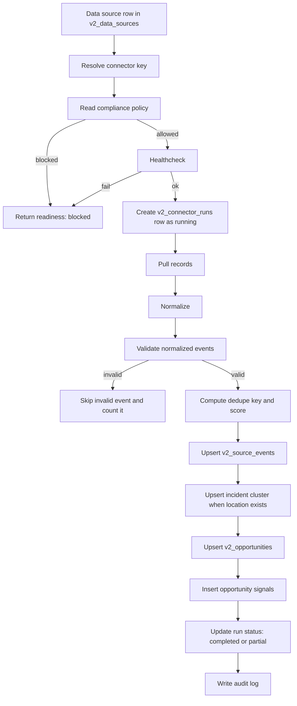

# Service Butler Source Connector Framework

This document defines the connector runtime that Service Butler should use for real live sources, with the current repo truth called out explicitly.

## Current Runtime Truth

The current connector system already has:

- a registry of adapters in `src/lib/v2/connectors/registry.ts`
- a common adapter type in `src/lib/v2/connectors/types.ts`
- source inference in `src/lib/v2/connectors/source-type-map.ts`
- a run ledger in `v2_connector_runs`
- a source-event ledger in `v2_source_events`
- health and run control routes under `src/app/api/data-sources/[id]/*`
- a webhook completion path in `src/app/api/webhooks/connectors/completed/route.ts`
- an Inngest trigger in `src/lib/workflows/v2-functions.ts`

The current limitation is that the framework is still pull-first, run-ledger-first, and mostly single-shot. It does not yet have a full checkpoint/cursor model, stale-run watchdog, or explicit webhook-source ingestion contract.

## Connector Lifecycle



## Adapter Contract

The repo already uses this interface shape in `src/lib/v2/connectors/types.ts`:

```ts
export interface ConnectorAdapter {
  readonly key: string;
  pull(input: ConnectorPullInput): Promise<Record<string, unknown>[]>;
  normalize(records: Record<string, unknown>[], input: ConnectorPullInput): Promise<ConnectorNormalizedEvent[]>;
  dedupeKey(event: ConnectorNormalizedEvent): string;
  classify(event: ConnectorNormalizedEvent): { opportunityType: string; serviceLine: string };
  compliancePolicy(input: ConnectorPullInput): ConnectorCompliancePolicy;
  healthcheck(input: ConnectorPullInput): Promise<ConnectorHealth>;
}
```

For a production-grade hands-off engine, the framework should keep that core interface but add optional capabilities so the runtime can distinguish polling, webhooks, feeds, scrape, and import flows.

Recommended extensions:

```ts
type ConnectorCapability = "poll" | "webhook" | "feed" | "scrape" | "import" | "enrichment_only";

type ConnectorRuntimeContext = {
  tenantId: string;
  sourceId: string;
  sourceType: string;
  config: Record<string, unknown>;
  cursor?: Record<string, unknown> | null;
  runId?: string;
  requestId?: string;
};

interface ConnectorAdapterV2 extends ConnectorAdapter {
  capabilities?: ConnectorCapability[];
  estimateFreshness?: (event: ConnectorNormalizedEvent) => number;
  verifyWebhook?: (request: Request) => Promise<boolean>;
  getCursor?: (source: Record<string, unknown>) => Promise<Record<string, unknown> | null>;
  saveCursor?: (cursor: Record<string, unknown>) => Promise<void>;
}
```

The goal is not to over-abstract. The goal is to make polling sources, webhook sources, and scraped sources behave consistently inside the same run ledger and source-event model.

## Ingestion Patterns

| Pattern | Best for | Current repo truth | Failure behavior | Freshness semantics | Rollout note |
| --- | --- | --- | --- | --- | --- |
| Polling | NOAA, Open311, USGS, OpenFEMA, Census, Overpass, provider APIs | Already implemented for most live sources. | Fetch failure returns empty results or a failed healthcheck, depending on the connector. | Use upstream event time where available, not `created_at` alone. | This is the main production pattern today. |
| Feed | Reddit search JSON, municipal JSON feeds, provider exports | Implemented where a feed URL or endpoint exists. | Missing config should stay blocked or empty. | Use upstream publication or request time. | Feeds should still normalize into `pull()` results so dedupe and scoring stay identical. |
| Scrape | Firecrawl-backed incident pages, distress pages, utility pages | Implemented for incident, social, and utility connectors. | Missing Firecrawl credentials or page URLs must fail closed. | Preserve page publish time when available; otherwise stamp with ingest time and lower freshness. | Scraped pages must retain original URL provenance end-to-end. |
| Import | Permits provider exports, CSV uploads, manual public-data imports | Only partially represented today through provider and sample-backed flows. | Import should never pretend to be live if it is manual or sample-backed. | Freshness should come from the imported record timestamp. | Import is useful for backfills, but it must never be conflated with live capture. |
| Webhook | Future real-time source partners | Not a source-ingestion path yet. The only current webhook here is connector-run completion. | Webhook ingestion must verify a shared secret or signature before writes. | Freshness is near-real-time and should be stamped from the event payload. | Webhooks should emit the same normalized event contract as polling. |

## Freshness Semantics

The code already computes freshness in several places:

- `src/lib/v2/data-sources.ts` derives a freshness score from the latest ingested event timestamp.
- `src/lib/v2/connectors/runner.ts` uses `occurredAt` to produce a data freshness score.
- Each connector normalizes upstream timestamps into `occurredAt`.

Recommended freshness rules:

| Source class | Freshness source | Staleness expectation | Operator meaning |
| --- | --- | --- | --- |
| Weather / incident / utility | Alert or incident timestamp | Minutes to a few hours | Urgent and time-sensitive |
| Open311 / permits | Request or issuance timestamp | Hours to a day | Actionable, but not always immediate |
| Social / public distress | Post or page publish time | Minutes to hours | Fast signal, noisy, SDR-first |
| OpenFEMA | Declaration time | Hours to days | Catastrophe context, not immediate contactability |
| Census / Overpass | Reference or page update time | Days to weeks | Enrichment and routing context, not direct lead evidence |

Freshness should always be stored in three different forms:

1. upstream event time in the normalized event
2. `ingested_at` in the source-event row
3. derived freshness score in the summary and run metadata

## Dedupe Semantics

The current implementation already uses three dedupe layers:

- `v2_source_events` has a unique constraint on `(source_id, dedupe_key)`
- `v2_opportunities` uses `explainability_json.dedup_key` to avoid duplicate opportunity creation across a tenant
- the scanner truth layer filters out synthetic rows before they affect operator metrics

Recommended dedupe rules:

| Layer | Key | Purpose |
| --- | --- | --- |
| Source event | Source-specific dedupe key from the connector | Prevent duplicate ingestion of the same upstream record |
| Opportunity | Address + city + state + postal + service line + source category | Prevent duplicate work items for the same real-world issue |
| Proof / metrics | Proof authenticity + connector input mode + source provenance | Prevent synthetic or sample-backed rows from counting as buyer proof |

Current dedupe behavior is good enough to prevent obvious duplicates, but it should eventually record the reason a candidate was collapsed, merged, or skipped.

## Compliance Gates

The current code already has hard gates in three places:

- `ConnectorCompliancePolicy` on each adapter
- `buildDataSourceReadinessState()` in `src/lib/control-plane/readiness.ts`
- the `runConnectorForSource()` guard in `src/lib/v2/connectors/runner.ts`

Recommended policy model:

| Field | Meaning |
| --- | --- |
| `termsStatus` | `approved`, `restricted`, `pending_review`, or `blocked` |
| `ingestionAllowed` | Can we ingest the source at all? |
| `outboundAllowed` | Can the source ever drive outbound? This should be stricter than ingestion for public data. |
| `requiresLegalReview` | Does a human need to approve the source before live use? |
| `notes` | Human-readable reason for the gate |

Recommended gate order:

1. validate tenant context and auth
2. resolve connector key
3. evaluate compliance policy
4. run healthcheck
5. require live config, never sample-backed config, for buyer-proof capture
6. run the connector
7. record the run and the proof trail

## Run Ledger And State Model

The database already has `v2_connector_runs.status` with `queued`, `running`, `completed`, `failed`, and `partial`.

That is a good start, but a hands-off engine also needs:

| State | Meaning | Current status in repo |
| --- | --- | --- |
| `queued` | Run requested but not started | Supported in the enum |
| `running` | Work in progress | Supported and used when inserting a run |
| `completed` | Everything validated and written cleanly | Supported |
| `partial` | Some records were valid, but one or more were invalid or skipped | Supported |
| `failed` | The connector or persistence path failed hard | Supported |
| `stale` | The run sat too long without finishing | Not yet implemented |
| `replayed` | A run was intentionally retried or backfilled | Not yet implemented |

Recommended metadata fields for `v2_connector_runs.metadata`:

- `connector_key`
- `source_type`
- `connector_input_mode`
- `cursor`
- `window_start`
- `window_end`
- `records_invalid`
- `records_skipped`
- `retry_count`
- `replay_of_run_id`
- `avg_data_freshness_score`
- `avg_source_reliability`

## Failure Behavior

The right failure posture is already visible in the code, but it should become more explicit.

Current behavior:

- healthcheck failure prevents the connector from running
- compliance failure marks the run failed immediately
- normalization validation drops bad events and can still finish as `partial`
- persistence errors throw and mark the run failed
- source-event or opportunity write failures should never silently pass

Recommended production behavior:

- fail closed when secrets, provider URLs, or terms approvals are missing
- keep the source visible in the control plane, but not in trusted throughput
- surface a specific remediation for each failure class
- allow reruns only through an explicit operator action or a supervised background job
- add a stale-run watchdog that flips runs to `stale` when they exceed their expected window

## Rollout Status Model

The current repo already uses several status dimensions:

- source row status: `active`, `paused`, `disabled`, `not_configured`
- runtime mode: `fully-live`, `live-partial`, `simulated`
- capture status: `capturing_live`, `live_safe_partial`, `blocked`, `simulated`
- proof authenticity: `live_provider`, `live_derived`, `synthetic`, `unknown`

For a clean source-rollout model, those should roll up into this ladder:

| Rollout status | Meaning |
| --- | --- |
| `draft` | Not yet created in the control plane |
| `seeded` | Exists in the control plane but not configured for live use |
| `simulated` | Sample-backed or fake-backed only |
| `live-partial` | Some live inputs exist, but a gate still blocks trusted throughput |
| `live-safe` | Live and healthy, but outbound remains constrained |
| `fully-live` | Live, healthy, and eligible for buyer-proof capture |
| `blocked` | Compliance or environment issue prevents live use |
| `deprecated` | Kept for history, but no longer part of the active source stack |

## What The Framework Still Needs

- explicit cursor support for polling connectors
- a true webhook-source adapter contract
- a stale-run watchdog and replay model
- a better run summary that includes invalid/skipped counts in every source summary
- stronger separation between enrichment-only sources and actual lead-driving sources
- a first-class notion of source freshness threshold by family

## Bottom Line

The current connector framework is real and useful, but it is still a pull-first ingestion layer with strong compliance gates and a partial run ledger. The next step is not a rewrite. The next step is to add durable source-family metadata, explicit freshness and replay semantics, and a stricter runtime model so live data sources can run hands-off without pretending sample-backed or partially configured sources are buyer-proof.

